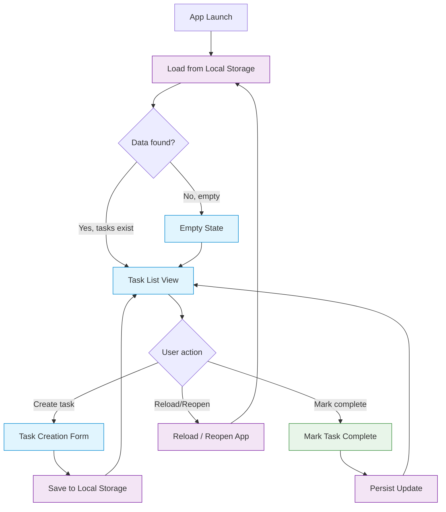

# Task Tracker Process Diagram

## Mermaid Flowchart (Top-Down)

## Story-to-Node Coverage Table

| Story | JIRA Key | Node(s) | Flow Pattern |
|-------|----------|---------|--------------|
| US-1: Create task | EPMCBACC-4131 | Task Creation Form → Save to Local Storage | User enters title/description, task saved and added to list |
| US-2: View all tasks | EPMCBACC-4132 | Empty State, Task List View, Load from Local Storage | Tasks loaded on startup and displayed in list view; empty message if none exist |
| US-3: Mark complete | EPMCBACC-4133 | Mark Task Complete → Persist Update | User selects task and marks complete; status persisted |
| US-4: Persist locally | EPMCBACC-4134 | Load from Local Storage, Save to Local Storage, Reload/Reopen App | All writes to local storage; data survives page reload |
| US-5: Simple UI | EPMCBACC-4135 | Task List View, Task Creation Form, Empty State | All UI nodes designed for simplicity and lightweight interaction |

## Node Coverage Verification

✓ **All 9 required nodes present:**
- App Launch (entry point)
- Load from Local Storage (persistence read)
- Empty State (first-use or cleared state)
- Task List View (main UI)
- Task Creation Form (create UI)
- Save to Local Storage (persistence write)
- Mark Task Complete (state change action)
- Persist Update (state change persistence)
- Reload / Reopen App (re-entry flow)

✓ **All 5 user stories mapped** to at least one node
✓ **All storage operations** explicitly shown (Load → decisions → Save/Persist/Reload)
✓ **Semantic styling** applied: storage nodes (purple), UI nodes (blue), action nodes (green)

## Key Design Decisions

1. **Load-on-Startup Pattern**: App Launch → Load from Local Storage ensures data recovery on every launch
2. **Empty State Handling**: Decision node validates whether data exists; directs to Empty State if no tasks
3. **Task List Loop**: All user actions (Create, Mark Complete, Reload) converge on Task List View for unified display
4. **Persistence Layers**: Separate nodes for Save (on creation) and Persist (on status update) to clarify dual write points
5. **Lightweight Implementation**: Storage-only (no backend) keeps entire flow local-first

## Notes

- The diagram satisfies all requirements in Requirements.txt (FR-1 through FR-4, NFR-1 through NFR-3)
- Each transition represents a discrete application state or user interaction
- Diagram type: `flowchart TD` (top-down orientation for left-to-right reading)
- Coverage table provides traceability from stories to process nodes
